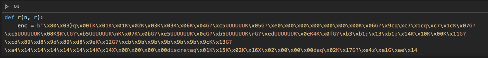
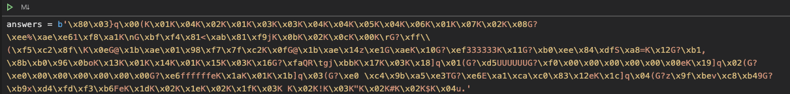

# ISML
1. Cursuri
2. Laboratoare
3. [ISML_answers_decrypt.ipynb](ISML_answers_decrypt.ipynb) ajuta la primele 4-5 teme, la exercitiile "grila". 

Se copiaza stringul de la inceputul fisierului (ex statinf1.ipynb)  si se pune in loc de stringul de la `answers` 
 si se ruleaza notebook-ul pentru a afisa rezultatele.